#Desciption des données analysées

Le fichier analysé ci-contre « j’informe les commerçants », des données ouvertes de la ville de Montréal, présente les résultats du sondage effectué par les employés de la ville de Montréal auprès des commerces de la ville de Montréal pendant la première phase de la Covid en avril 2020. Ce sondage consistait surtout à recueillir des informations sur les commerces et l’impact de la pandémie sur leurs activités et surtout à les informer du programme d’urgence de soutien aux commerces mis en place par la ville de Montreal pendant la Covid, et partager des informations susceptibles de les aider à s’adapter à la situation. Il ressort de l’analyse statistique effectuée sous la base de données agrégés et de graphiques générés, que plusieurs commerces ont pu survivre et garder leurs portes ouvertes pendant la pandémie, d’autres ont dû fermés leurs portes. Plusieurs de ces commerces ont signifiés avoir des enjeux de santé et sécurité à gérer, et ont démontré un intérêt certain pour le programme d’aide d’urgence, le soutien financier et d’autres initiatives de la ville tel que démontre les tableaux agrégés et graphiques de corrélations sur les centres d’intérêts des commerces relativement à leurs réponses sur les enjeux sur lesquels ils ont été interrogés.


```python
"""
Importation de librairies
"""
import numpy as np
import pandas as pd
import matplotlib.pyplot as plt

```


```python
# Lecture de fichier csv et affichage des 5 premièrs lignes du fichier
df = pd.read_csv('../data/j_informe_les_commercants.csv', sep = ',')
print(df.columns) # Affichages des différentes entrées/colonnes du fihiers csv
df.head() # Affichage des premières lignes du fihier csv 
```

    Index(['ID Réponse', 'Date', 'Phase', 'Type de territoire',
           'Arrondissement / Ville liée', 'Statut du commerce',
           'Enjeux: Soutien financier?', 'Enjeux: Maintien des opérations?',
           'Enjeux: Fiscalité (taxes et impôts)?', 'Enjeux: Ressources humaines?',
           'Enjeux: Réglementation?', 'Enjeux: Marketing?',
           'Enjeux: Santé et sécurité?',
           'Enjeux: Recherche d'équipement sanitaire?',
           'Enjeux: Aménagement de l'espace?',
           'Enjeux: Permis pour les terrasses extérieures?', 'Enjeux: Autre?',
           'Intérêt pour le programme d'aide d'urgence?',
           'Présence sur les médias sociaux?', 'Présence sur Facebook?',
           'Présence sur Twitter?', 'Présence sur Instagram?',
           'Présence sur LinkedIn?', 'Faites-vous de la vente en ligne?',
           'Canal de vente en ligne',
           'Connaissez-vous le service de livraison urbaine?',
           'Êtes-vous intéressé par le service de livraison urbaine?',
           'Intérêt pour le programme d'accompagnement pour le virage numérique des entreprises?',
           'Offrez-vous un service de livraison?',
           'Êtes-vous satisfait de votre service de livraison actuel?',
           'Seriez-vous intéressé par le service de livraison urbain (à vélo) mise en place par la Ville de Montréal et ses partenaires si vous si aviez accès?',
           'Est-ce que l'information que nous vous avons donnée vous a été utile?'],
          dtype='object')
    


<div>
<style scoped>
    .dataframe tbody tr th:only-of-type {
        vertical-align: middle;
    }

    .dataframe tbody tr th {
        vertical-align: top;
    }

    .dataframe thead th {
        text-align: right;
    }
</style>
<table border="1" class="dataframe">
  <thead>
    <tr style="text-align: right;">
      <th></th>
      <th>ID Réponse</th>
      <th>Date</th>
      <th>Phase</th>
      <th>Type de territoire</th>
      <th>Arrondissement / Ville liée</th>
      <th>Statut du commerce</th>
      <th>Enjeux: Soutien financier?</th>
      <th>Enjeux: Maintien des opérations?</th>
      <th>Enjeux: Fiscalité (taxes et impôts)?</th>
      <th>Enjeux: Ressources humaines?</th>
      <th>...</th>
      <th>Présence sur LinkedIn?</th>
      <th>Faites-vous de la vente en ligne?</th>
      <th>Canal de vente en ligne</th>
      <th>Connaissez-vous le service de livraison urbaine?</th>
      <th>Êtes-vous intéressé par le service de livraison urbaine?</th>
      <th>Intérêt pour le programme d'accompagnement pour le virage numérique des entreprises?</th>
      <th>Offrez-vous un service de livraison?</th>
      <th>Êtes-vous satisfait de votre service de livraison actuel?</th>
      <th>Seriez-vous intéressé par le service de livraison urbain (à vélo) mise en place par la Ville de Montréal et ses partenaires si vous si aviez accès?</th>
      <th>Est-ce que l'information que nous vous avons donnée vous a été utile?</th>
    </tr>
  </thead>
  <tbody>
    <tr>
      <th>0</th>
      <td>1</td>
      <td>2020-05-12</td>
      <td>1</td>
      <td>Arrondissement</td>
      <td>Le Plateau-Mont-Royal</td>
      <td>Ouvert</td>
      <td>NaN</td>
      <td>Oui</td>
      <td>NaN</td>
      <td>Oui</td>
      <td>...</td>
      <td>NaN</td>
      <td>Non</td>
      <td>Pas de vente en ligne</td>
      <td>Sans réponse</td>
      <td>Sans réponse</td>
      <td>Non, je n'ai pas d'intérêt à faire un virage n...</td>
      <td>Question non posée lors de l'appel</td>
      <td>Question non posée lors de l'appel</td>
      <td>Question non posée lors de l'appel</td>
      <td>Non</td>
    </tr>
    <tr>
      <th>1</th>
      <td>2</td>
      <td>2020-05-12</td>
      <td>1</td>
      <td>Arrondissement</td>
      <td>Outremont</td>
      <td>Partiellement ouvert</td>
      <td>Oui</td>
      <td>NaN</td>
      <td>NaN</td>
      <td>NaN</td>
      <td>...</td>
      <td>NaN</td>
      <td>Non</td>
      <td>Pas de vente en ligne</td>
      <td>Non</td>
      <td>Oui</td>
      <td>Non, je n'ai pas d'intérêt à faire un virage n...</td>
      <td>Question non posée lors de l'appel</td>
      <td>Question non posée lors de l'appel</td>
      <td>Question non posée lors de l'appel</td>
      <td>Oui</td>
    </tr>
    <tr>
      <th>2</th>
      <td>3</td>
      <td>2020-05-12</td>
      <td>1</td>
      <td>Arrondissement</td>
      <td>Le Plateau-Mont-Royal</td>
      <td>Ouvert</td>
      <td>NaN</td>
      <td>NaN</td>
      <td>NaN</td>
      <td>Oui</td>
      <td>...</td>
      <td>NaN</td>
      <td>Oui</td>
      <td>Site transactionnel</td>
      <td>Oui</td>
      <td>Non</td>
      <td>Non, j'ai déjà ce qu'il me faut pour faire un ...</td>
      <td>Question non posée lors de l'appel</td>
      <td>Question non posée lors de l'appel</td>
      <td>Question non posée lors de l'appel</td>
      <td>Oui</td>
    </tr>
    <tr>
      <th>3</th>
      <td>4</td>
      <td>2020-05-12</td>
      <td>1</td>
      <td>Arrondissement</td>
      <td>Le Plateau-Mont-Royal</td>
      <td>Fermé</td>
      <td>Oui</td>
      <td>NaN</td>
      <td>NaN</td>
      <td>NaN</td>
      <td>...</td>
      <td>NaN</td>
      <td>Non</td>
      <td>Pas de vente en ligne</td>
      <td>Oui</td>
      <td>Non</td>
      <td>Je ne sais pas</td>
      <td>Question non posée lors de l'appel</td>
      <td>Question non posée lors de l'appel</td>
      <td>Question non posée lors de l'appel</td>
      <td>Oui</td>
    </tr>
    <tr>
      <th>4</th>
      <td>5</td>
      <td>2020-05-12</td>
      <td>1</td>
      <td>Arrondissement</td>
      <td>Le Plateau-Mont-Royal</td>
      <td>Statut inconnu</td>
      <td>Oui</td>
      <td>Oui</td>
      <td>NaN</td>
      <td>NaN</td>
      <td>...</td>
      <td>NaN</td>
      <td>Oui</td>
      <td>Site transactionnel</td>
      <td>Non</td>
      <td>Oui</td>
      <td>Oui</td>
      <td>Question non posée lors de l'appel</td>
      <td>Question non posée lors de l'appel</td>
      <td>Question non posée lors de l'appel</td>
      <td>Oui</td>
    </tr>
  </tbody>
</table>
<p>5 rows × 32 columns</p>
</div>


```python
#convertir la colone 'Date' en Datetime
df['Date'] = pd.to_datetime(df['Date'], format='%Y-%m-%d')
#Compter le nombre d'occurence de chaque date ou les informations ont été transmises aux commercants lors du sondage
df_group_by_date = df.groupby(['Date'])['Date'].count()
print(df_group_by_date)
#Affichage du diagramme sur le nombre d'appels de commercants par date
df_group_by_date.plot()

plt.title('Nombre appels de commerce par date')
plt.xlabel('Date')
plt.ylabel('Nombre appels')
plt.show()
```

    Date
    2020-05-12    12
    2020-05-13    68
    2020-05-14    64
    2020-05-15    42
    2020-05-19    49
                  ..
    2020-09-04    31
    2020-09-08    39
    2020-09-09    36
    2020-09-10     9
    2020-09-11     6
    Name: Date, Length: 85, dtype: int64
    


    
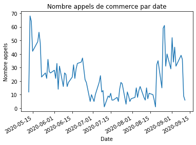
    


```python
# diagramme représentatif du statut des différents commerces
df_group_by_statut = df.groupby(['Statut du commerce'])['Statut du commerce'].count()
print(df_group_by_statut)

df_group_by_statut.plot.pie()
plt.show()
```

    Statut du commerce
    Fermé                    149
    Ouvert                  1254
    Partiellement ouvert     328
    Statut inconnu           165
    Name: Statut du commerce, dtype: int64
    


    
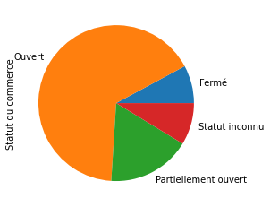
    


```python
# Proportion des commerces contactés par phase pour le sondage 
df_group_by_phase = df.groupby(['Phase'])['Statut du commerce'].count()
print(df_group_by_phase)

df_group_by_phase.plot.bar()
plt.title('Commerces contactés par phase')
plt.xlabel('phases')
plt.ylabel('Nombre de commerce')
plt.show()
```

    Phase
    1    506
    2    607
    3    264
    4    519
    Name: Statut du commerce, dtype: int64
    


    
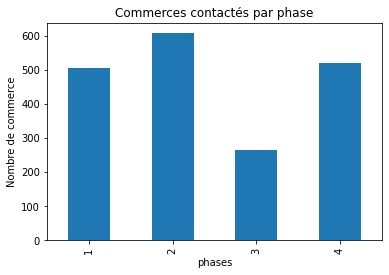
    


```python
# Description de données sur la colonne 'Arrondissement / Ville liée'
df_group_by_arrondissement = df['Arrondissement / Ville liée'].describe()

df_group_by_arrondissement
```


    count                                     1347
    unique                                      28
    top       Villeray-Saint-Michel-Parc-Extension
    freq                                       201
    Name: Arrondissement / Ville liée, dtype: object


```python
# Données agrégées sur le statut de commerce par arrondissement
df['Arrondissement / Ville liée'].value_counts()
```


    Villeray-Saint-Michel-Parc-Extension        201
    Le Plateau-Mont-Royal                       175
    Côte-des-Neiges-Notre-Dame-de-Grâce         152
    Rosemont-La Petite-Patrie                   135
    Ville-Marie                                  64
    Ahuntsic-Cartierville                        62
    Montréal-Nord                                61
    Pierrefonds-Roxboro                          58
    Saint-Léonard                                57
    Mercier-Hochelaga-Maisonneuve                57
    Saint-Laurent                                42
    LaSalle                                      42
    Dollard-des-Ormeaux                          31
    Verdun                                       30
    Westmount                                    28
    Rivière-des-Prairies-Pointe-aux-Trembles     27
    Outremont                                    25
    Kirkland                                     17
    Pointe-Claire                                17
    Anjou                                        16
    Le Sud-Ouest                                 14
    Dorval                                       12
    Montréal-Ouest                                7
    L'Île-Bizard-Sainte-Geneviève                 5
    Lachine                                       4
    Mont-Royal                                    4
    Île-Bizard-Sainte-Geneviève                   2
    Beaconsfield                                  2
    Name: Arrondissement / Ville liée, dtype: int64


```python
# Données agrégées sur le statut de commerce par ville
df_group_by_ville = df.groupby(['Arrondissement / Ville liée','Statut du commerce'])['Statut du commerce'].count()

print(df_group_by_ville)
```

    Arrondissement / Ville liée  Statut du commerce  
    Ahuntsic-Cartierville        Fermé                   11
                                 Ouvert                  38
                                 Partiellement ouvert    10
                                 Statut inconnu           3
    Anjou                        Fermé                    1
                                                         ..
    Westmount                    Fermé                    8
                                 Ouvert                   9
                                 Partiellement ouvert     5
                                 Statut inconnu           6
    Île-Bizard-Sainte-Geneviève  Ouvert                   2
    Name: Statut du commerce, Length: 93, dtype: int64
    


```python
# Données agrégées sur le statut de commerce par date
df = pd.read_csv('../data/j_informe_les_commercants.csv', sep = ',')

df_group_by_date = df.groupby(['Date','Statut du commerce'])['Statut du commerce'].count()
df_group_by_date
#df_group_by_date.plot()
plt.show()
```


```python
#Courbe représentative de nombre de commerces ouverts par date
df = pd.read_csv('../data/j_informe_les_commercants.csv', sep = ',')
df_ouvert = df[df['Statut du commerce'] == "Ouvert"]
df_group_by_date_ouvert = df_ouvert.groupby(['Date'])['Date'].count()
#df_group_by_date_ouvert
df_group_by_date_ouvert.plot()

plt.title('Commerces ouverts par date')
plt.xlabel('Date')
plt.ylabel('Commerces ouverts')
plt.show()

```


    
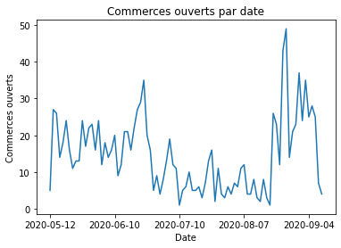
    


```python
#Courbe représentative de nombre de commerces fermés par date
df = pd.read_csv('../data/j_informe_les_commercants.csv', sep = ',')
df_fermes = df[df['Statut du commerce'] == "Fermé"]
df_group_by_date_fermes= df_fermes.groupby(['Date'])['Date'].count()
df_group_by_date_fermes.plot()

plt.title('Commerces fermés par date')
plt.xlabel('Date')
plt.ylabel('Commerces fermés')
plt.show()
```


    
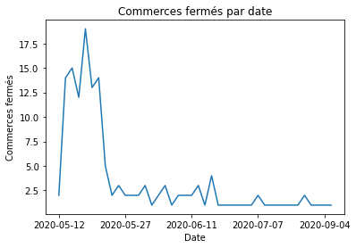
    


```python
#Statistiques sur les réponses des commerces relatif à la question sur le programme d'accompagnement des entreprises pour le virage vers le numérique
df = pd.read_csv('../data/j_informe_les_commercants.csv', sep = ',')
#fig, ax = plt.subplots(figsize=(15,7))
#df_group_by_numerique = df.groupby(['Statut du commerce',"Intérêt pour le programme d'accompagnement pour le virage numérique des entreprises?"])['Statut du commerce'].count().unstack().plot(ax=ax)
#Affichage du diagramme à barre pour mieux visualiser
df_group_by_numerique = df.groupby(["Statut du commerce","Intérêt pour le programme d'accompagnement pour le virage numérique des entreprises?"])["Statut du commerce"].count().unstack(0).plot.barh()
plt.title('Intéret pour accompagenement numérique')
plt.xlabel('Commerces par statut')
plt.ylabel('Interet')
plt.show()
```


    
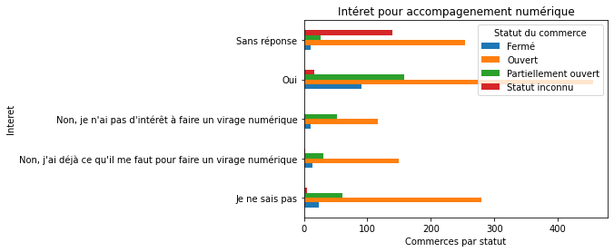
    


```python
#Données agrégées sur le statut des commerce et leur canal de vente
df = pd.read_csv('../data/j_informe_les_commercants.csv', sep = ',')
#fig, ax = plt.subplots(figsize=(15,7))
#df_group_by_date = df.groupby(['Statut du commerce',"Intérêt pour le programme d'accompagnement pour le virage numérique des entreprises?"])['Statut du commerce'].count().unstack().plot(ax=ax)
df_group_by_canal_vente = df.groupby(["Statut du commerce",'Canal de vente en ligne'])['Statut du commerce'].count()
print(df_group_by_canal_vente)
```

    Statut du commerce    Canal de vente en ligne                                          
    Fermé                 Non applicable                                                        22
                          Oui, à l'aide d'un système maison, mais seulement depuis la crise      7
                          Pas de vente en ligne                                                 78
                          Réponse inconnue                                                      12
                          Site transactionnel                                                   24
                          Système maison, disponible avant la crise                              6
    Ouvert                Non applicable                                                       140
                          Oui, à l'aide d'un système maison, mais seulement depuis la crise      5
                          Pas de vente en ligne                                                528
                          Réponse inconnue                                                     407
                          Site transactionnel                                                  156
                          Système maison, disponible avant la crise                              8
                          Via un tiers (ex. : Amazon, Wayfair, Uber Eats, etc.)                 10
    Partiellement ouvert  Non applicable                                                        36
                          Oui, à l'aide d'un système maison, mais seulement depuis la crise      3
                          Pas de vente en ligne                                                157
                          Réponse inconnue                                                      61
                          Site transactionnel                                                   63
                          Système maison, disponible avant la crise                              7
                          Via un tiers (ex. : Amazon, Wayfair, Uber Eats, etc.)                  1
    Statut inconnu        Non applicable                                                         3
                          Oui, à l'aide d'un système maison, mais seulement depuis la crise      1
                          Pas de vente en ligne                                                  6
                          Réponse inconnue                                                     152
                          Site transactionnel                                                    3
    Name: Statut du commerce, dtype: int64
    


```python
#Statistiques de réponses des commerces sur la vente en ligne et leur canal de vente 
df = pd.read_csv('../data/j_informe_les_commercants.csv', sep = ',')
#fig, ax = plt.subplots(figsize=(15,7))
#df_group_by_date = df.groupby(['Statut du commerce',"Intérêt pour le programme d'accompagnement pour le virage numérique des entreprises?"])['Statut du commerce'].count().unstack().plot(ax=ax)
df_group_by_canal_ligne = df.groupby(["Faites-vous de la vente en ligne?",'Canal de vente en ligne'])['Faites-vous de la vente en ligne?'].count()
df_group_by_canal_ligne
```


    Faites-vous de la vente en ligne?  Canal de vente en ligne                                          
    Non                                Non applicable                                                        15
                                       Pas de vente en ligne                                                769
                                       Réponse inconnue                                                       2
    Non applicable                     Non applicable                                                       186
    Oui                                Oui, à l'aide d'un système maison, mais seulement depuis la crise     16
                                       Réponse inconnue                                                      46
                                       Site transactionnel                                                  246
                                       Système maison, disponible avant la crise                             21
                                       Via un tiers (ex. : Amazon, Wayfair, Uber Eats, etc.)                 11
    Réponse inconnue                   Réponse inconnue                                                     584
    Name: Faites-vous de la vente en ligne?, dtype: int64


```python
"""df = pd.read_csv('../data/j_informe_les_commercants.csv', sep = ',')
df['Date'] = pd.to_datetime(df['Date'], format='%Y-%m-%d')
df['Date'] = pd.to_datetime(df['Date'])
df.set_index('Date', inplace=True)
df = df.resample('M').count()
pas nécessaire"""

```


    "df = pd.read_csv('../data/j_informe_les_commercants.csv', sep = ',')\ndf['Date'] = pd.to_datetime(df['Date'], format='%Y-%m-%d')\ndf['Date'] = pd.to_datetime(df['Date'])\ndf.set_index('Date', inplace=True)\ndf = df.resample('M').count()\npas nécessaire"


```python
#Statistiques les commerces avec enjeux pour le maintien d'opérations, les ressources humaines et la vente en ligne
df = pd.read_csv('../data/j_informe_les_commercants.csv', sep = ',')
#df_fermes = df[df['Enjeux: Maintien des opérations?'] == "Oui"] 
df_group_by_date = df.groupby(['Date'])[['Enjeux: Ressources humaines?', 'Enjeux: Maintien des opérations?', 'Faites-vous de la vente en ligne?']].count()
print(df_group_by_date)
#Calul de corrélation sur les réponses de commerces à ces questions
print(df_group_by_date.corr())
df_group_by_date.plot()
plt.show()
```

                Enjeux: Ressources humaines?  Enjeux: Maintien des opérations?  \
    Date                                                                         
    2020-05-12                             2                                 3   
    2020-05-13                             8                                13   
    2020-05-14                             7                                13   
    2020-05-15                             2                                 8   
    2020-05-19                             3                                 7   
    ...                                  ...                               ...   
    2020-09-04                             1                                 0   
    2020-09-08                             5                                 2   
    2020-09-09                             4                                 0   
    2020-09-10                             0                                 0   
    2020-09-11                             0                                 1   
    
                Faites-vous de la vente en ligne?  
    Date                                           
    2020-05-12                                 12  
    2020-05-13                                 68  
    2020-05-14                                 64  
    2020-05-15                                 42  
    2020-05-19                                 49  
    ...                                       ...  
    2020-09-04                                 31  
    2020-09-08                                 39  
    2020-09-09                                 36  
    2020-09-10                                  9  
    2020-09-11                                  6  
    
    [85 rows x 3 columns]
                                       Enjeux: Ressources humaines?  \
    Enjeux: Ressources humaines?                           1.000000   
    Enjeux: Maintien des opérations?                       0.546849   
    Faites-vous de la vente en ligne?                      0.734648   
    
                                       Enjeux: Maintien des opérations?  \
    Enjeux: Ressources humaines?                               0.546849   
    Enjeux: Maintien des opérations?                           1.000000   
    Faites-vous de la vente en ligne?                          0.648700   
    
                                       Faites-vous de la vente en ligne?  
    Enjeux: Ressources humaines?                                0.734648  
    Enjeux: Maintien des opérations?                            0.648700  
    Faites-vous de la vente en ligne?                           1.000000  
    


    
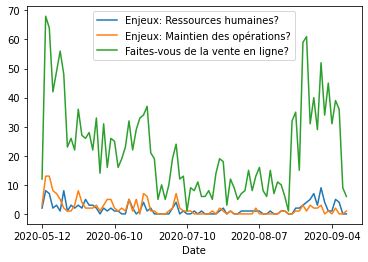
    


```python

```


```python
df = pd.read_csv('../data/j_informe_les_commercants.csv', sep = ',')
#df_fermes = df[df['Enjeux: Maintien des opérations?'] == "Oui"] 
df_group_by_date = df.groupby(['Date'])[['Enjeux: Ressources humaines?', 'Faites-vous de la vente en ligne?']].count()
print(df_group_by_date.corr())
df_group_by_date.plot()
plt.show()
```

                                       Enjeux: Ressources humaines?  \
    Enjeux: Ressources humaines?                           1.000000   
    Faites-vous de la vente en ligne?                      0.734648   
    
                                       Faites-vous de la vente en ligne?  
    Enjeux: Ressources humaines?                                0.734648  
    Faites-vous de la vente en ligne?                           1.000000  
    


    
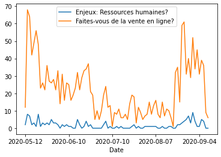
    


```python
#statistiques sur les commerces ayant un intérêt pour le programme d'aide d'urgence,pour le programme d'accompagnement pour le virage vers le numérique, et sur utilité de information transmise
df = pd.read_csv('../data/j_informe_les_commercants.csv', sep = ',')
df_oui = df[df["Intérêt pour le programme d'aide d'urgence?"] == "Oui"]
df_oui = df[df['Intérêt pour le programme d\'accompagnement pour le virage numérique des entreprises?'] == "Oui"]
df_oui = df[df[ 'Est-ce que l\'information que nous vous avons donnée vous a été utile?'] == "Oui"]
#Affichage de statistique de commerce ayant répondu oui aux trois questions
print(df_oui)
df_group_by_date = df.groupby(['Date'])[['Intérêt pour le programme d\'aide d\'urgence?', 'Intérêt pour le programme d\'accompagnement pour le virage numérique des entreprises?', 'Est-ce que l\'information que nous vous avons donnée vous a été utile?']].count()
#df_group_by_date = df.groupby(['Date'])[["Intérêt pour le programme d'aide d'urgence?", 'Intérêt pour le programme d\'accompagnement pour le virage numérique des entreprises?', 'Est-ce que l\'information que nous vous avons donnée vous a été utile?']].count()

print(df_group_by_date)
#Calcul de corrélation
print(df_group_by_date.corr())
# Affichage de courbe pour visualiser la correlation
df_group_by_date.plot()
plt.show()
```

          ID Réponse        Date  Phase Type de territoire  \
    1              2  2020-05-12      1     Arrondissement   
    2              3  2020-05-12      1     Arrondissement   
    3              4  2020-05-12      1     Arrondissement   
    4              5  2020-05-12      1     Arrondissement   
    5              6  2020-05-12      1     Arrondissement   
    ...          ...         ...    ...                ...   
    1887        1888  2020-09-10      4                NaN   
    1888        1889  2020-09-10      4                NaN   
    1890        1891  2020-09-11      4                NaN   
    1891        1892  2020-09-11      4                NaN   
    1895        1896  2020-09-11      4                NaN   
    
         Arrondissement / Ville liée    Statut du commerce  \
    1                      Outremont  Partiellement ouvert   
    2          Le Plateau-Mont-Royal                Ouvert   
    3          Le Plateau-Mont-Royal                 Fermé   
    4          Le Plateau-Mont-Royal        Statut inconnu   
    5          Le Plateau-Mont-Royal                Ouvert   
    ...                          ...                   ...   
    1887                         NaN                Ouvert   
    1888                         NaN                Ouvert   
    1890                         NaN                Ouvert   
    1891                         NaN                Ouvert   
    1895                         NaN  Partiellement ouvert   
    
         Enjeux: Soutien financier? Enjeux: Maintien des opérations?  \
    1                           Oui                              NaN   
    2                           NaN                              NaN   
    3                           Oui                              NaN   
    4                           Oui                              Oui   
    5                           NaN                              NaN   
    ...                         ...                              ...   
    1887                        NaN                              NaN   
    1888                        Oui                              NaN   
    1890                        Oui                              NaN   
    1891                        Oui                              Oui   
    1895                        NaN                              NaN   
    
         Enjeux: Fiscalité (taxes et impôts)? Enjeux: Ressources humaines?  ...  \
    1                                     NaN                          NaN  ...   
    2                                     NaN                          Oui  ...   
    3                                     NaN                          NaN  ...   
    4                                     NaN                          NaN  ...   
    5                                     NaN                          NaN  ...   
    ...                                   ...                          ...  ...   
    1887                                  NaN                          NaN  ...   
    1888                                  NaN                          NaN  ...   
    1890                                  NaN                          NaN  ...   
    1891                                  NaN                          NaN  ...   
    1895                                  NaN                          NaN  ...   
    
         Présence sur LinkedIn? Faites-vous de la vente en ligne?  \
    1                       NaN                               Non   
    2                       NaN                               Oui   
    3                       NaN                               Non   
    4                       NaN                               Oui   
    5                       NaN                               Non   
    ...                     ...                               ...   
    1887                    NaN                  Réponse inconnue   
    1888                    NaN                  Réponse inconnue   
    1890                    NaN                               Oui   
    1891                    NaN                               Non   
    1895                    NaN                               Non   
    
         Canal de vente en ligne Connaissez-vous le service de livraison urbaine?  \
    1      Pas de vente en ligne                                              Non   
    2        Site transactionnel                                              Oui   
    3      Pas de vente en ligne                                              Oui   
    4        Site transactionnel                                              Non   
    5      Pas de vente en ligne                                              Oui   
    ...                      ...                                              ...   
    1887        Réponse inconnue                                     Sans réponse   
    1888        Réponse inconnue                                     Sans réponse   
    1890     Site transactionnel                                     Sans réponse   
    1891   Pas de vente en ligne                                     Sans réponse   
    1895   Pas de vente en ligne                                     Sans réponse   
    
         Êtes-vous intéressé par le service de livraison urbaine?  \
    1                                                   Oui         
    2                                                   Non         
    3                                                   Non         
    4                                                   Oui         
    5                                                   Non         
    ...                                                 ...         
    1887                                       Sans réponse         
    1888                                       Sans réponse         
    1890                                       Sans réponse         
    1891                                       Sans réponse         
    1895                                       Sans réponse         
    
         Intérêt pour le programme d'accompagnement pour le virage numérique des entreprises?  \
    1     Non, je n'ai pas d'intérêt à faire un virage n...                                     
    2     Non, j'ai déjà ce qu'il me faut pour faire un ...                                     
    3                                        Je ne sais pas                                     
    4                                                   Oui                                     
    5     Non, j'ai déjà ce qu'il me faut pour faire un ...                                     
    ...                                                 ...                                     
    1887                                       Sans réponse                                     
    1888                                       Sans réponse                                     
    1890                                                Oui                                     
    1891                                     Je ne sais pas                                     
    1895                                                Oui                                     
    
         Offrez-vous un service de livraison?  \
    1      Question non posée lors de l'appel   
    2      Question non posée lors de l'appel   
    3      Question non posée lors de l'appel   
    4      Question non posée lors de l'appel   
    5      Question non posée lors de l'appel   
    ...                                   ...   
    1887                         Sans réponse   
    1888                         Sans réponse   
    1890                       Non applicable   
    1891                       Non applicable   
    1895                       Non applicable   
    
         Êtes-vous satisfait de votre service de livraison actuel?  \
    1                    Question non posée lors de l'appel          
    2                    Question non posée lors de l'appel          
    3                    Question non posée lors de l'appel          
    4                    Question non posée lors de l'appel          
    5                    Question non posée lors de l'appel          
    ...                                                 ...          
    1887                                       Sans réponse          
    1888                                       Sans réponse          
    1890                                       Sans réponse          
    1891                                       Sans réponse          
    1895                                       Sans réponse          
    
         Seriez-vous intéressé par le service de livraison urbain (à vélo) mise en place par la Ville de Montréal et ses partenaires si vous si aviez accès?  \
    1                    Question non posée lors de l'appel                                                                                                    
    2                    Question non posée lors de l'appel                                                                                                    
    3                    Question non posée lors de l'appel                                                                                                    
    4                    Question non posée lors de l'appel                                                                                                    
    5                    Question non posée lors de l'appel                                                                                                    
    ...                                                 ...                                                                                                    
    1887                                       Sans réponse                                                                                                    
    1888                                       Sans réponse                                                                                                    
    1890                                     Non applicable                                                                                                    
    1891                                     Non applicable                                                                                                    
    1895                                     Non applicable                                                                                                    
    
         Est-ce que l'information que nous vous avons donnée vous a été utile?  
    1                                                   Oui                     
    2                                                   Oui                     
    3                                                   Oui                     
    4                                                   Oui                     
    5                                                   Oui                     
    ...                                                 ...                     
    1887                                                Oui                     
    1888                                                Oui                     
    1890                                                Oui                     
    1891                                                Oui                     
    1895                                                Oui                     
    
    [1516 rows x 32 columns]
                Intérêt pour le programme d'aide d'urgence?  \
    Date                                                      
    2020-05-12                                           12   
    2020-05-13                                           68   
    2020-05-14                                           64   
    2020-05-15                                           42   
    2020-05-19                                           49   
    ...                                                 ...   
    2020-09-04                                           31   
    2020-09-08                                           39   
    2020-09-09                                           36   
    2020-09-10                                            9   
    2020-09-11                                            6   
    
                Intérêt pour le programme d'accompagnement pour le virage numérique des entreprises?  \
    Date                                                                                               
    2020-05-12                                                 12                                      
    2020-05-13                                                 68                                      
    2020-05-14                                                 64                                      
    2020-05-15                                                 42                                      
    2020-05-19                                                 49                                      
    ...                                                       ...                                      
    2020-09-04                                                 31                                      
    2020-09-08                                                 39                                      
    2020-09-09                                                 36                                      
    2020-09-10                                                  9                                      
    2020-09-11                                                  6                                      
    
                Est-ce que l'information que nous vous avons donnée vous a été utile?  
    Date                                                                               
    2020-05-12                                                 12                      
    2020-05-13                                                 68                      
    2020-05-14                                                 64                      
    2020-05-15                                                 42                      
    2020-05-19                                                 49                      
    ...                                                       ...                      
    2020-09-04                                                 31                      
    2020-09-08                                                 39                      
    2020-09-09                                                 36                      
    2020-09-10                                                  9                      
    2020-09-11                                                  6                      
    
    [85 rows x 3 columns]
                                                        Intérêt pour le programme d'aide d'urgence?  \
    Intérêt pour le programme d'aide d'urgence?                                                 1.0   
    Intérêt pour le programme d'accompagnement pour...                                          1.0   
    Est-ce que l'information que nous vous avons do...                                          1.0   
    
                                                        Intérêt pour le programme d'accompagnement pour le virage numérique des entreprises?  \
    Intérêt pour le programme d'aide d'urgence?                                                       1.0                                      
    Intérêt pour le programme d'accompagnement pour...                                                1.0                                      
    Est-ce que l'information que nous vous avons do...                                                1.0                                      
    
                                                        Est-ce que l'information que nous vous avons donnée vous a été utile?  
    Intérêt pour le programme d'aide d'urgence?                                                       1.0                      
    Intérêt pour le programme d'accompagnement pour...                                                1.0                      
    Est-ce que l'information que nous vous avons do...                                                1.0                      
    


    
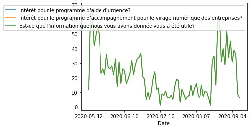
    


```python
df = pd.read_csv('../data/j_informe_les_commercants.csv', sep = ',')
#fig, ax = plt.subplots(figsize=(15,7))
#df_group_by_date = df.groupby(['Statut du commerce',"Intérêt pour le programme d'accompagnement pour le virage numérique des entreprises?"])['Statut du commerce'].count().unstack().plot(ax=ax)
df_group_by_statut = df.groupby(['Intérêt pour le programme d\'aide d\'urgence?','Statut du commerce'])['Intérêt pour le programme d\'aide d\'urgence?'].count().unstack(0).plot.barh()
plt.show()
```


    
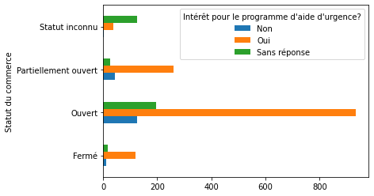
    


```python
# Statistique sur les enjeux de soutien financier par statut du commerce
df = pd.read_csv('../data/j_informe_les_commercants.csv', sep = ',')
#fig, ax = plt.subplots(figsize=(15,7))
#df_group_by_soutien_financier = df.groupby(['Statut du commerce',"Intérêt pour le programme d'accompagnement pour le virage numérique des entreprises?"])['Statut du commerce'].count().unstack().plot(ax=ax)
df_group_by_soutien_financier = df.groupby(['Enjeux: Soutien financier?','Statut du commerce'])['Enjeux: Soutien financier?'].count().unstack(0).plot.barh()
plt.title('Soutien financier par statut du commerce')
plt.ylabel('Statut du commerce')
plt.show()
```


    
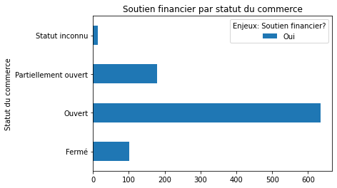
    


```python
# Statistique sur réponses des commerces relatives aux enjeux de santé liés à la pandémie 
df = pd.read_csv('../data/j_informe_les_commercants.csv', sep = ',')
#fig, ax = plt.subplots(figsize=(15,7))
#df_group_by_accompagnement = df.groupby(['Statut du commerce',"Intérêt pour le programme d'accompagnement pour le virage numérique des entreprises?"])['Statut du commerce'].count().unstack().plot(ax=ax)
df_group_by_accompagnement = df.groupby(['Enjeux: Santé et sécurité?','Statut du commerce'])['Enjeux: Soutien financier?'].count().unstack(0).plot.barh()
print(df_group_by_accompagnement)
plt.show()

#Statistique de l'utilité des enjeux
df_group_by_utilite = df.groupby(['Date'])[['Enjeux: Santé et sécurité?',"Enjeux: Recherche d'équipement sanitaire?", 'Enjeux: Soutien financier?','Est-ce que l\'information que nous vous avons donnée vous a été utile?']].count()
#Calcul de corrélation sur les commerces qui ont trouvé de l'utilité aux informations transmises et les enjeux sanitaire rencontrés par ces commerces
print(df_group_by_utilite.corr())
# Affichage de courbe pour visualiser la correlation
df_group_by_utilite.plot()

plt.title('Observation des enjeux')
plt.show()
```

    AxesSubplot(0.125,0.125;0.775x0.755)
    


    
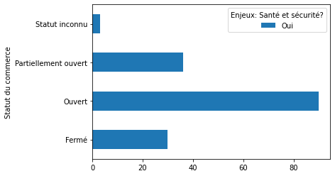
    


                                                        Enjeux: Santé et sécurité?  \
    Enjeux: Santé et sécurité?                                            1.000000   
    Enjeux: Recherche d'équipement sanitaire?                             0.789172   
    Enjeux: Soutien financier?                                            0.649455   
    Est-ce que l'information que nous vous avons do...                    0.603573   
    
                                                        Enjeux: Recherche d'équipement sanitaire?  \
    Enjeux: Santé et sécurité?                                                           0.789172   
    Enjeux: Recherche d'équipement sanitaire?                                            1.000000   
    Enjeux: Soutien financier?                                                           0.573284   
    Est-ce que l'information que nous vous avons do...                                   0.598614   
    
                                                        Enjeux: Soutien financier?  \
    Enjeux: Santé et sécurité?                                            0.649455   
    Enjeux: Recherche d'équipement sanitaire?                             0.573284   
    Enjeux: Soutien financier?                                            1.000000   
    Est-ce que l'information que nous vous avons do...                    0.922959   
    
                                                        Est-ce que l'information que nous vous avons donnée vous a été utile?  
    Enjeux: Santé et sécurité?                                                                   0.603573                      
    Enjeux: Recherche d'équipement sanitaire?                                                    0.598614                      
    Enjeux: Soutien financier?                                                                   0.922959                      
    Est-ce que l'information que nous vous avons do...                                           1.000000                      
    


    
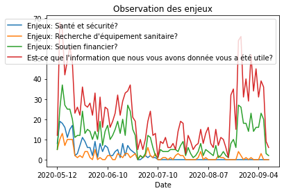
    


```python

```
